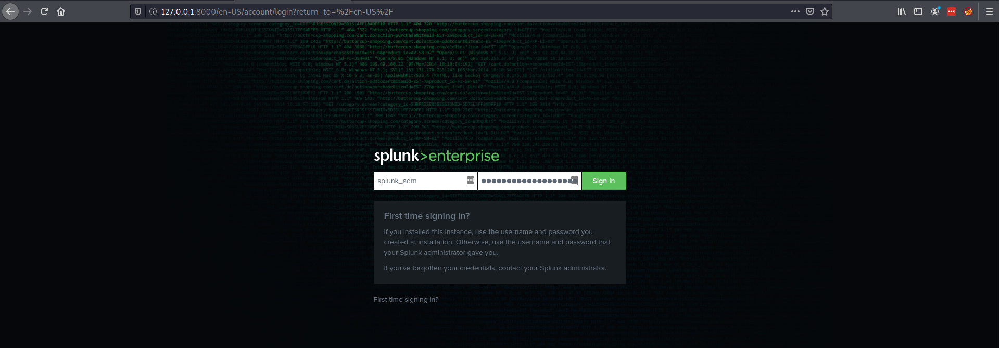

# Installation on Deb
1. On the terminal, execute the following command:
```bash
wget -O splunk-8.0.0-1357bef0a7f6-linux-2.6-amd64.deb 'https://www.splunk.com/bin/splunk/DownloadActivityServlet?architecture=x86_64&platform=linux&version=8.0.0&product=splunk&filename=splunk-8.0.0-1357bef0a7f6-linux-2.6-amd64.deb&wget=true'
```
2. Install Splunk:
```bash
sudo dpkg -i splunk-8.0.0-1357bef0a7f6-linux-2.6-amd64.deb
```
*Note*: this process might take a while, please be patient until it completes!.

3. Start Splunk at boot:
```bash
sudo /opt/splunk/bin/splunk enable boot-start
```
4. Read the license (or press `q` button to skip):
```bash
[...]
Do you agree with this license? [y/n]: y
```
5. Enter `administrator` username, then press `Enter`:
```bash
Please enter an administrator username: splunk_adm
```
6. Enter and confirm administrator's `password`, then press `Enter`:
```bash
Password must contain at least:
   * 8 total printable ASCII character(s).
Please enter a new password: SplunkAdministrator$123
Please confirm new password: SplunkAdministrator$123
```
7. Start Splunk service:
```bash
sudo service splunk start
```
8. Confirm if the service is successfully started:
```md
ss -anlt

State                 Recv-Q                Send-Q                                 Local Address:Port                                 Peer Address:Port                Process                
LISTEN                0                     128                                          0.0.0.0:8000                                      0.0.0.0:*                                          
```
+ By default, Splunk listens on `localhost`, port `8000`.
+ We can confirm that by navigating to the `http://localhost:8000` using Chrome or any web browser.


+ More info of Splunk's installation, please refers to the [link.](https://docs.splunk.com/Documentation/Splunk/8.1.2/SearchTutorial/InstallSplunk)
