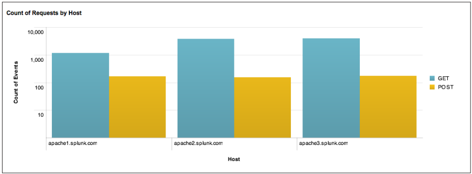

# **Common SPL Commands**

| Category                                | Description                                                                                                                          | Commands                                   |
| --------------------------------------- | ------------------------------------------------------------------------------------------------------------------------------------ | ------------------------------------------ |
| Sorting Results                         | Ordering results and limiting the number of result                                                                                   | `sort`                                     |
| Filtering Results                       | Taking a set of events or results and filtering them into a smaller set of results                                                   | `search`, `where`, `dedup`, `head`, `tail` |
| Grouping Results                        | Grouping events so you can see patterns                                                                                              | `transaction`                              |
| Reporting Results                       | Taking search results and generating summary for reporting                                                                           | `top/rare`, `stats`, `chart`, `timechart`  |
| Filtering, Modifying, and Adding fields | Filtering out or removing some fields to focus on the ones you need, or modifying or adding fields to enrich your results or events. | `fields`,`replace`,`eval`,`rex`,`lookup`   |

<hr>

# **Sorting Results**

## **sort**
The `sort` command sorts search results by the specified fields.

+ Examples:

```md
... | sort 0 field1 
```

→ Sort results in ascending order by `field1`, returns all results (`0` means return everything).

```md
... | sort field1,-field2
```

→Sort `field1` in ascending order, and `field2` in descending order, returning up to 10,000 results (by default).

```md
... | sort filename
... | sort num(filename)
... | sort str(filename)
```

+ Sort results by `filename`.
→ The first command lets Slunk decide how to sort the field **values**.
→ The second command asks Splunk to sort `filename` **numerically**.
→ The thrid command tells Splunk to sort the values **lexicographically**.
			(Lexicographical order: **123, 132, 213, 231, 312, and 321**.)
			
*Note:* by default, ascending order is the default order for search results.

+ The results might looks like this:


<hr>

# **Filtering Results**
These commands take the results from a previous command and filter them into a smaller set of results.

## **where**
+ The `where` command filters result based on an expression.
+ If the evaluation is successful and the result is `true`, the result is retained, otherwise, the result is discarded.

**Example 1**:

```md
source=job_listings | where salary > industry_average
```

+ The above example will return a list of jobs that has `salary` greater than `industry_average`.

+ Or we can also specify an explicit value.

```md
source=job_listings | where salary > 70000
```

<br>

**Example 2**:

```md
... | where distance/time > 100
```

→ Keep results whose `distance` divided by `time` is greater than `100`.


<br>

**Example 3**:
+ Keep results that match the IP address or are in the specified subnet.


```md
... | where like(src, "10.10.10.%") OR cidrmatch("10.10.10.0/24", dst)
```

<br>

## **dedup**
→ Primarily used to remove redundant data.
→ The amount of results are based on `count` value.

**Example 1:**
+ Keeps the first result of each **unique** `host`.
```md
... | dedup host
```

+ Keeps each unique `source` and sorted by `delay` field in descending order.
```md
... | dedup source sortby -delay 
```

+ Keeps the first result for each **unique combination** of `source` and `host`.
```md
... | dedup source,host 
```

+ Keeps the first result for each unique `source`, **including null value**.
```md
... | dedup source keepempty=true
```


**Example 2:**

+ 3 are the `count`, which means it keeps `3` results of each unique `host`
```md
... | dedup 3 source 
```

<br>


##### **Tips and Tricks**:
+ Keeps all results and remove duplications only, use: `keepevents` option.
+ Using the `sortby` option to filter value.
+ `keepnull=<true/false>` option can be used to override the default behaviors.

<br>

## **head**
+ Returns first `count` results.
+ ***Note: the oppsite `head` is `tail`.***

**For example:**

+ The following command will return first `5` results.
```md
... | head 5
```

+ Following image will best illustrate the concept:


+ The following command will return the `first` events until it reaches an event, which does **NOT** have an `action` field with the value `startup`.
+ In order words, we just want the first **events** with a `startup` value.  

```md
... | head (action="startup")
```

<hr>

# **Grouping Results**
## **transaction**
+ Group all the events, which meet `transaction` conditions.
+ Here are some examples to clarify the concepts:

1. `... | transaction clientip maxpause=5s`

+ The commands will group events:
	+ Have the same client IP address → `clientip`.
	+ Have no gaps or pauses longer than 5 seconds → `maxpause=5s`.

2. `... | transaction clientip host maxspan=30s maxpause=5s`

+ The commands will group events:
	+ Have the same client IP address. → `clientip`.
	+ Have the same host. → `host`.
	+ First and last event gap of each session **<=** 30 seconds. `maxspan=30s`.
	+ Have no gaps or pauses longer than 5 seconds → `maxpause=5s`.

3. `transaction clientip maxspan=10m maxevents=3`
+ The commands will group events:
	+ Have the same client IP address. → `clientip`.
	+ First and last event gap of each session **<=** 10 minutes. `maxspan=10m`.
	+ Mo more than three events.

**All together**

```md
sourcetype=access* | transaction JSESSIONID clientip startwith="signon" endwith="purchase" | where duration > 1
```

+ The commands  will retrieve web access events → `sourcetype=access*`, then
	+ Group all events:
		+ Have same SESSION ID → `JSESSIONID`.
		+ Have the same client IP address. → `clientip`.
		+ First event contains the string **signon** → `startwith="signon"`.
		+ Last event contains the string **purchase** → `endwith="purchase"`.
	 + And filter transactions that took less than 1 second to complete. → `duration > 1`.


##### **Take away concepts**
+ `transaction` arguments (`startwith`, `endwith`) are optional, but some arguments as `clientip`, `JSESSIONID` must be specified to instruct grouping conditions.


+ Splunk does not need a `conjunction` (`field1 AND field2`) or disconjunction (`field1 OR field2`), `transaction` will automatically do it.

**For example:** if we search 3 events with query: `transaction host cookie`. We might ends up grouping the following events into a single `transaction`.

+ `event=1 host=a` → `event1`
+ `event=2 host=a cookie=b` → `event2`
+ `event=3 cookie=b` → `event3`

→ The first two events (`event1` and `event2`) will be joined because they have the same host (`host=a`).
→ The two last events (`event2` and `event3`) will be joined because they have the same cookie (`cookie=b`).

+ The `transaction` command results two important fields:
	+ `duration`: timestamp gap for the first and last events in the transaction.
	+ `eventcount`: number of events in the transaction.

+ Later on, we'll look at the `stat` command. It's worth noticing that they all aggregate events, but here are a few disintctions:
	+ `stat` calculates statistical values on events grouped by the value of fields. 
		
		→ Statistics and human-readable.
		
	+ `transaction` focuses on how events are grouped by providing various arguments.
		
		→ Heavily groups the events, presents in raw text and is hard to read. 
		
<hr>

# **Reporting Results**

Reporting commands: `top`, `stats`, `chart` and `timechart`.

## **top**
+ Given a list of fields, `top` command reports the frequency of those field values, along with their count and percentage.

+ ***Note: the opposite `top` is `rare`***.
+ Examples:

1. `... | top 20 url`

→ The command will return the 20 most common URLs.

2. `... | top 2 user by host`

→ Return the top 2 frequent users for each host. 


<hr>

## **stats**
+ Is used to calculate aggregate statistics over a dataset.

+ The result might be presented in a table format, and might contain a row which has the aggregation in the incoming result, or a row for each distinct value.

+ Other commands acts as `stats`:
	+ `chart`: returns the same table of results, with rows as arbitrary field.
	+ `timechart`: return the same table of results, but the row is set to the internal field, `_time`, which allows to chart the results based on a time range.

+ Examples:

1. `... | stats dc(host)`

+ Return the distinct count of `host` values.

2. `... | stats avg(kbps) by host`

+ Return the average transfer rate for each `host`.

3. `... | stats count(eval(method="GET")) as GET, count(eval(method="POST")) as POST by host`

+ Return the total of requests (`POST` and `GET`) for each `host`. 

***Note: with `as`, `POST` can be used as a name alias for `count(eval(method="POST"))`***.

+ The following image will best demonstrate the idea.


4. `... | top limit=100 referer_domain | stats sum(count) as total`

+ Returns the total number of hits from the top 100 values of `referer_domain`.

5. `... | stats count, max(Magnitude), min(Magnitude), range(Magnitude), avg(Magnitude) by Region`

+ `Magnitude` is just a USGS data.
+ As we can see, the query processes the `count`, `max`, etc. and additional statistic for each `Region`.

6.  `… | stats values(product_type) as Type, values(product_name) as Name, sum(price) as "Revenue" by product_id | rename product_id as "Product ID" | eval Revenue="$".tostring(Revenue,"commas")`

+ Returna table with `Type`, `Name` and `Revenue` of each `product_id`.
+ Reformat the `Revenue` as `$123,345`.

+ Some useful statistical functions:

1. ***Mathematical Calculation:***

| Command                | Description                                                                                                                                                                        |
| ---------------------- | ----------------------------------------------------------------------------------------------------------------------------------------------------------------------- |
| `avg(X)`                 | Returns average of the values of field X; see also, mean(X) .                                                                                                           |
| `count(X)`             | Returns the number of occurrences of the field X; to indicate a field value to match, format the X argument as an expression: eval(field="value") .                     |
| `dc(X)`                | Returns the count of distinct values of field X.                                                                                                                        |
| `max(X)`               | Returns the maximum value of field X. If the values are non-numeric, the max is determined per lexicographic ordering.                                                  |
| `median(X)`            | Returns the middle-most value of field X.                                                                                                                               |
| `min(X)`               | Returns the minimum value of field X. If the values are non-numeric, the min is determined per lexicographic ordering.                                                  |
| `mode(X)`              | Returns the most frequent value of field X.                                                                                                                             |
| `perc<percent-num>(X)` | Returns the \<percent-num\>-th value of field X; for example, `perc5(total)` returns the 5 th percentile value of the total field.                                      |
| `range(X)`             | Returns the difference between the max and min values of field X, provided values are numeric.                                                                          |
| `stdev(X)`             | Returns the sample standard deviation of field X. You can use wildcards when you specify the field name; for example, "delay", which matches both "delay" and "xdelay". |
| `sum(X)`               | Returns the sum of the values of field X.                                                                                                                               |
| `var(X)`               | Returns the sample variance of field X.                                                                                                                                 |
	
2. ***Value Selections***


| Command     | Description                                                                                                                        |
| ----------- | ---------------------------------------------------------------------------------------------------------------------------------- |
| `first(X)`  | Returns the first value of field X; opposite of last(X) .                                                                          |
| `last(X)`   | Returns the last value of field X; opposite of first(X). Generally, a field’s last value is the most chronologically oldest value. |
| `list(X)`   | Returns the list of all values of field X as a multivalue entry. The order of the values matches the order of input events.        |
| `values(X)` | Returns a list (as a multivalue entry) of all distinct values of field X, ordered lexicographically.                               |

3. ***`timechart` command only.*** ( ***Not apply to `chart` or `stats` command***)

| Command         | Description                            |
| --------------- | -------------------------------------- |
| `per_day(X)`    | Returns the rate of field X per day    |
| `per_hour(X)`   | Returns the rate of field X per hour   |
| `per_minute(X)` | Returns the rate of field X per minute |
| `per_second(X)` | Returns the rate of field X per year   |

<br>

## chart
+ Creates a tabular data output suitable for charting. You can specify the x-axis variable using `over` or `by`.

1. `... | chart max(delay) over host`

+ Return `max(delay)` for each value of `host`.

2. `... | chart max(delay) by size bins=10`

+ Chart the maximum `delay` by `size`, where `size` is broken down into a maximum of 10 equal-size bucket.

3. `... | chart eval(avg(size)/max(delay)) as ratio by host user`

+ Chart the ratio of the average (mean) `size` to the maximum `delay` for each distinct `host` and `user` pair.

4. `... | chart dc(clientip) over date_hour by category_id usenull=f`

+ Chart the number of unique `clientip` values per hour by category, `usenull=f` excludes fields that don’thave a value.

5. `... | chart count over Magnitude by Region useother=f`

+ Chart the number of earthwakes by `Magnitude` and `Region`. 
+ Use the `useother=f` argument to not output an `other` value for rarer `Regions`.

6. `… | chart count(eval(method=”GET”)) as GET, count(eval(method=”POST”)) as POST by host`

+ Chart the number of `GET` and `POST` page requests that occurred for each Web server ( host )



<br>

## timechart
+ As the name suggested, the `timechart` command creates a chart for statistical aggregation apply to the field against time in the x-axis.

Example commands:

1. `... | timechart span=1m avg(CPU) by host`

+ Chart the average value of CPU usage each minute for each host.

2. `... | timechart span=1d count by product-type`

+ Chart the number of purchases made daily for each type of product daily.

3. `... | timechart avg(cpu_seconds) by host | outlier`

+ Chart the average `cpu_seconds` by `host` and remote outlying values that may distort the timechart's y-axis.

4. `... | timechart per_hour(price) by product_name`

+ Chart hourly revenue for the products that were purchased yesterday.
+ The `per_hour()` function sums the values of the price field for each item `product_name` and scales that sum appropriately depending on the timespan of each bucket.

+ **Tabulated Results:**


+ **Formatted Timechart:**


5. `... | timechart per_hour(eval(method="GET")) as Views, per_hour(eval(action="purchase")) as Purchases`

+ Chart the number of `Views` against the numer of `Purchases` hourly. This resolves the question - How many views did not lead to purchases?

6. `... | timechart count(eval(method="GET")) as GET, count(eval(method="POST")) as POST`

+ Chart the number of page requests over time.

<hr>

# **Filtering, Modifying, and Adding Fields**
+ These commands in this section will help us to filter, modify and manipulate our search results.

| Command   | Description                                                                                                                                               |
| --------- | ------------------------------------------------------------------------------------------------------------------------------------------------------- |
| `field`   | Simplify results by removing some fields                                                                                                                |
| `replave` | Make field values become more readable for a particular audience                                                                                        |
| `eval`    | Calculate the values of a new field based on other fields                                                                                               |
| `rex`     | Create new fields using regular expression, to extracting patterned data into other fields                                                              |
| `lookup`  | Add fields based on looking at the value in an event, referencing a lookup table, adding the fields in matching rows in the lookup table to your event. |

<br>

## **fields**
+ Remove fields from the search results.
+ Example:

1. `... | fields - field1, field2`

+ Remove `field1` and `field2` from the search results.

2. `... | fields field1 field2`

+ Keep only `field1` and `field2`

3. `... | fields field1 error*`

+ Keep only `field1` and all fields, whose name begin with `error`

4. `... | fields field1 field2 | fields - _*`

+ Keep only `field1` and `field2` and remove all internal fields, (which begins with an underscore (`_`)). Proceeds with cautions because it might render incorrect results in the future search.


##### **Take away**
+ Internal fields i.e. fields start with underscore are unaffected by the `fields` command, unless explicitly specified.

<br>

## **replace**
+ The `replace` command performs a search-and-replace for specified field values with replacement values.

Examples:

1. `replace *localhost with localhost in host`

+ Change any `host` value that ends with `localhost` to `localhost`.

2. `replace 0 with Critical, 1 with Error in msg_level`

+ Change `msg_level` values of `0` to `Critical`, and change `msg_level` values of `1` to `Error`.

3. `replace aug with August in start_month end_month`

+ Change any `start_month` or `end_month` value of `aug` to `August`.

4. `replace 127.0.0.1 with localhost`

+ Change all field values of `127.0.0.1` to `localhost`.


<br>

## **eval**
+ The `eval` command calculates an expression and puts the results into a new field.

Examples:

1. `… | eval velocity=distance/time`

+ Set `velocity` to `distance` divided by `time`.

2. `… | eval status = if(error == 200, “OK”, “Error”)`

+ Set `status` to `OK` if `error` is `200`; otherwise set `status` to `Error`.

3. `… | eval sum_of_areas = pi()* pow(radius_a, 2) + pi() * pow(radius_b, 2)`

+ Set `sum_of_areas` to be the sum of the areas of two circles.


<hr>

## **rex**
+ Extract fields and values that matches a specified Regular Expression.

Example:

1. `... | rex “From: (?<from>.*) To: (?<to>.*)”`

+ Extract from and to fields using regular expressions. If a raw event contains `“From: Susan To: Bob”` , then `from=Susan` and `to=Bob`.

2. `rex field=savedsearch_id (?<user>\w+);(?<app>\w+); (?<SavedSearchName>\w+)`

+ Extract `user` ,`app` , and `SavedSearchName` from a field called `savedsearch_id`. If `savedsearch_id = “bob;search;my_saved_search”` , then `user=bob`, `app=search`, and `SavedSearchName=my_saved_search`.

3. `rex mode=sed “s/(\\d{4}-){3}/XXXX-XXXX-XXXX-/g”`

+ Use `sed` syntax to match the regex to a series of numbers, and replace them with an anonymized string.


<br>

## **lookup**
+ A `lookup` command manually invokes field lookups from a lookup table, enabling you to add field values from an external source.

Examples:

1.`... | lookup usertogroup user as local_user OUTPUT group as user_group`

+ For a lookup table with fields `user` and `group` , specified in stanza name
`usertogroup` in `transform.conf`, look up the value of each event’s `local_user` field. 

+ For entries that match, the value of the lookup table’s group field is written to the event’s `user_group` field.

2. `... | lookup dnslookup host OUTPUT ip`

+ Given a field lookup named `dnslookup` , referencing a Python script that performs a reverse DNS lookup and accepts either a host name or IP address as arguments, match the host name values ( host field in your events to the host name values in the table, and then add the corresponding IP address values to your events (in the ip field).

3. `… | lookup local=true userziplookup user as local_user OUTPUT zip as user_zip`

+ For a local lookup table that is present only in the search head, look up the value of each event’s `user` field. For entries that match, the value of the lookup table’s `zip` field is written to the event’s `user_zip` field.


